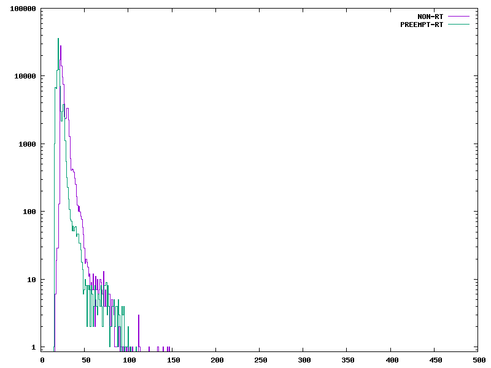
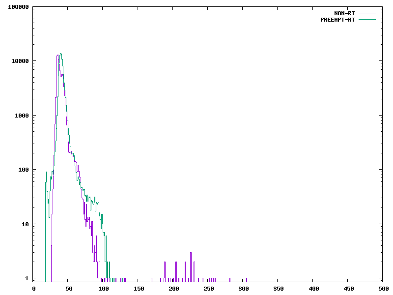

# Question answers
1. Julia works at National Instruments
2. PREEMPT-RT is a patch to turn the linux kernel to support Real-time threads. This requires the drivers you are using to support real-time requirements.
3. Mixed criticality is the existance of two different levels of timing requirements for different programs on a system.
4. Bad drivers can mess up real-time kernels by having long times when interrupts are disabled, making higher-priority interrupts have long delays. these are harder to fixed when the drivers are to support IRQ chips or are run by the scheduler. they could also be written poorly and have been written fast not well.
5. the $\delta$ in figure 1 is a symbol to represent latency.
6. Cycletest is a program for benchmarking realtime systems. Specifically it measures latency for different threads at different priority levels.
7. figure 2 is a histogram of particular thread interrupt latency for a real-time opperating system and a non-realtime opperating system
8. dispatch latency is the time between the event occuring and the event handler catching the interrupt and spawning a thread to handle it. Scheduling latency is the time between the thread spawning and being executed in a cpu.

9. mainline is the  most official version of the linux kernel pushed by the linux foundation.
10. in figure three, a low-priority interrupt is setup to run as the main thread with interrupts disabled. Therefore, as long as it is running, the scheduler can't run and tasks can't be switched. This means that if a high-priority, critical interrupt occurs while this task is running, the high-priority task can't start because the scheduler, which would figure out that the new event is higher priority and change to running that code, is disabled.
11. in figure four, the part of the interrupt handler that runs outside hte scheduler is only the code that is required to clear interrupt flags and spawn a thread. This thread mostly allows context switching throughout most of its execution, so when a higher priority event occurs, the interrupt code can run, spawn a higher prioryt thread and return to the scheduler, who sees that the new intterupt is higher priority and runs that task.

# Realtime kernel guide
start with uname_r=4.19.94-ti-r64

I modified the 400 number in the hist.gen script to 500.
to produce the load, i used the fastToggle.py script from homework 2 as I remember it loaded the non-rt kernell to 100%

 is a histogram produced without load for the two modes.
 has the board loaded by maximum rate gpio toggling.

comparing the curves, we see that the realtime system does not have significantly different average latency, but it has a lower standard deviation on the latency. with the load I provided, I believe the bound on latency can be placed below 150 microseconds but I would need to see the spec to say for certain.

# hw06 grading

| Points      | Description |
| ----------- | ----------- |
|  2/2 | Project 
|  5/5 | Questions
|  4/4 | PREEMPT_RT
|  2/2 | Plots to 500 us
|  5/5 | Plots - Heavy/Light load
|  2/2 | Extras
| 20/20 | **Total**

*My comments are in italics. --may*
